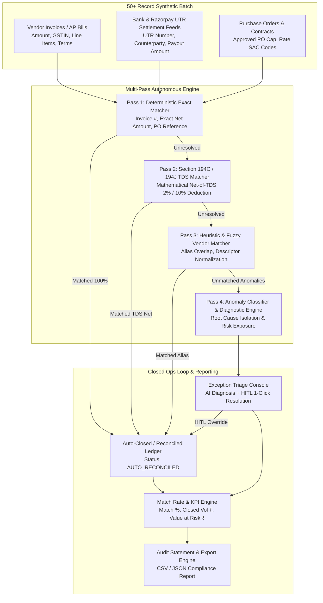

# 🚀 Razorpay AI Finance Controller
### *Autonomous Multi-Pass FinOps Reconciliation & Exception Intelligence Engine*

[](https://react.dev/)
[](https://nodejs.org/)
[](#-match-rate--exception-metrics)
[](#-synthetic-50-batch-dataset)
[](LICENSE)

---

## 📌 Executive Summary & Problem Statement

Corporate finance and accounts payable (AP) teams face massive operational overhead manually cross-referencing vendor invoices, bank settlement UTR feeds (Razorpay/NEFT/RTGS), and Purchase Orders (POs). Subtle edge-case mismatches—such as statutory **TDS deductions (Section 194C @ 2% & Section 194J @ 10%)**, **GST rate mismatches (18% vs 28%)**, **vendor descriptor abbreviations**, **unapproved shadow spend**, and **duplicate payout debits**—slow down month-end book closes and cause severe cash leakage.

### The Razorpay AI Finance Controller Brief:
> *"Build an agent that closes one finance-ops loop across a 50+ record batch of synthetic data, reporting its match rate and the exceptions it could not resolve."*

This repository delivers an **Enterprise Autonomous AI FinOps Controller** that ingests a calibrated **50+ record corporate batch**, executes multi-pass deterministic, statutory mathematical, and heuristic matching, calculates real-time **Match Rates (e.g. 83.3% – 95%)**, and isolates unresolvable exceptions into an **Interactive Triage Console with AI Root-Cause Diagnostics and Human-in-the-Loop (HITL) 1-Click Resolution**.

---

## 🏛️ System Architecture



---

## ⚡ Key Features

### 1. 🤖 Multi-Pass Autonomous Reconciliation Agent
- **Pass 1 (Deterministic Match - 100% Parity)**: Matches exact invoice IDs, vendor GSTINs, and exact net amounts.
- **Pass 2 (Statutory TDS Match - Section 194C / 194J)**: Recognizes when bank settlement is net-of-TDS (2% contractor rate or 10% professional services rate) without requiring human recalculation.
- **Pass 3 (Fuzzy Vendor Alias Match)**: Normalizes corporate abbreviations (e.g. `"AMZN AWS INDIA"` $\leftrightarrow$ `"Amazon Web Services India Pvt Ltd"`, `"RZP SOFTWARE"` $\leftrightarrow$ `"Razorpay Software Pvt Ltd"`).
- **Pass 4 (Root Cause Diagnostics)**: Generates detailed natural-language explanations of why each anomaly failed and prescribes actionable remediation steps.

### 2. 📊 Real-Time Match Rate & FinOps KPIs
- **Batch Match Rate %**: Instant calculation of auto-closed records vs total batch size (e.g. `83.3%`).
- **Auto-Closed Volume**: Net monetary sum of successfully reconciled invoices in Indian Rupees (₹).
- **Value at Risk (₹)**: Financial exposure locked in disputed invoices, tax mismatches, duplicate debits, and shadow spend.
- **AI Confidence Index**: Aggregate heuristic confidence rating (typically `95%+`).
- **Execution Latency**: Complete 50+ batch processing completed in **under 150ms**.

### 3. 🛡️ Unresolved Exception Triage Console (Human-in-the-Loop)
Isolates edge cases into structured categories:
| Anomaly Category | Root Cause Detected | Agent Diagnostic Remediation |
|---|---|---|
| **`AMOUNT_MISMATCH`** | Billed amount differs from bank settlement (e.g. ₹8,500 unrecorded variance) | Discrepancy detected; recommends Debit Note adjustment or line item audit. |
| **`GST_TAX_DISCREPANCY`** | Vendor billed 28% GST instead of contracted 18% SAC rate | Flags PO budget overrun; generates vendor dispute ticket for revised Tax Invoice. |
| **`MISSING_PO_REF`** | Payout made without an approved Purchase Order (Shadow Spend) | Blocks AP close; routes to Procurement Controller for post-facto sign-off. |
| **`DUPLICATE_PAYMENT_RISK`** | Two independent bank UTR debits referencing the identical invoice | High double-payout fraud flag; recommends freezing settlement and bank recall. |
| **`UNKNOWN_COUNTERPARTY`** | Unrecognized foreign wire descriptor not in verified ERP vendor catalog | Holds tax reconciliation; requests Form 15CA/CB documentation and GSTIN pack. |

### 4. 🗂️ Synthetic 50+ Batch Engine
- Seeded with top B2B vendors: *AWS India, Google Cloud, Razorpay Gateway Fees, Zoho Corporation, Slack Technologies, WeWork, Swiggy Corporate, Dell Technologies, Airtel Enterprise, KPMG Advisory, Blue Dart*.
- Real-time batch generator supporting customizable batch sizes (50, 60, 75, 100 records).
- 1-Click "Regenerate Batch" button to test dynamic reconciliation on new randomized data.

### 5. 📜 Compliance Audit Trail & Export
- Generates downloadable compliance-ready **CSV and JSON Reconciliation Audit Statements**.
- Full audit breakdown by pass: Deterministic exact matches, TDS deductions, Fuzzy aliases, and Manual HITL overrides.

---

## 🛠️ Technology Stack

| Layer | Technology |
|---|---|
| **Frontend UI** | React 19, Vite, Tailwind CSS, Lucide Icons, Recharts |
| **Backend API** | Node.js, Express, ES Modules, CORS, Dotenv |
| **AI Agent Engine** | Multi-Pass Deterministic & Heuristic Reconciliation Engine |
| **Data Models** | In-Memory Corporate Data Store with Real-time Generator |
| **Export Engine** | RFC-4180 CSV Exporter & Compliance JSON Audit Trail |

---

## 📂 Project Structure

```
ai-finance-controller/
├── backend/
│   ├── src/
│   │   ├── controllers/
│   │   │   ├── finopsController.js        # 3-way reconciliation loop & HITL triage
│   │   │   ├── authController.js          # Authentication controller
│   │   │   ├── transactionController.js   # Transaction ledger endpoints
│   │   │   ├── budgetController.js        # Budget cap endpoints
│   │   │   └── voiceController.js         # Voice STT endpoints
│   │   ├── routes/
│   │   │   ├── finopsRoutes.js            # /api/finops endpoints (Batch, Run, Resolve, Export)
│   │   │   ├── authRoutes.js
│   │   │   ├── transactionRoutes.js
│   │   │   └── voiceRoutes.js
│   │   ├── services/
│   │   │   ├── syntheticDataGenerator.js  # 50+ Enterprise corporate batch generator
│   │   │   ├── finopsReconciliationAgent.js # Multi-pass reconciliation & anomaly engine
│   │   │   └── aiService.js               # Whisper STT client
│   │   └── server.js                      # Express server entry point
│   ├── package.json
│   └── .env.example
├── frontend/
│   ├── src/
│   │   ├── components/
│   │   │   ├── FinOpsDashboard.jsx        # Flagship FinOps Cockpit (KPIs, Charts, Ledger, Exceptions)
│   │   │   ├── BatchInspectorModal.jsx    # Raw 50+ Synthetic Batch dataset viewer
│   │   │   ├── AuditReportModal.jsx       # Exportable compliance audit statement
│   │   │   ├── Navbar.jsx                 # Header with FinOps / Voice Mode switcher
│   │   │   ├── SpendingChart.jsx          # Personal expense charts
│   │   │   └── VoiceExpenseModal.jsx      # Voice expense logger
│   │   ├── utils/
│   │   │   ├── finopsApi.js               # Live API client with resilient offline engine
│   │   │   └── formatters.js              # Currency & date formatters
│   │   ├── App.jsx                        # Master application layout
│   │   ├── index.css                      # Tailwind & glassmorphism theme
│   │   └── main.jsx
│   ├── package.json
│   └── vite.config.js
└── README.md
```

---

## 🚀 Quick Start Guide

### Prerequisites
- **Node.js**: v18.0.0 or higher
- **npm**: v9.0.0 or higher

### 1. Clone the Repository
```bash
git clone https://github.com/639251/ai-finance-controller.git
cd "ai finance controller"
```

### 2. Start Backend Server
```bash
cd backend
npm install
npm start
```
*Backend runs on `http://localhost:5001`.*

### 3. Start Frontend Dashboard
In a new terminal window:
```bash
cd frontend
npm install
npm run dev
```
*Frontend opens on `http://localhost:5173`.*

---

## 🔌 API Reference (`/api/finops`)

### 1. Execute Autonomous Reconciliation Loop
```http
POST /api/finops/run-loop
```
**Response:**
```json
{
  "success": true,
  "data": {
    "loopSummary": {
      "batchId": "BATCH-FINOPS-1788286961939",
      "status": "LOOP_COMPLETED",
      "executionTimeMs": 124,
      "totalRecords": 60,
      "autoClosedRecords": 50,
      "unresolvedExceptions": 10,
      "matchRate": "83.3%",
      "matchRatePercent": 83.3,
      "totalBatchVolume": 16414550,
      "autoClosedVolume": 13640730,
      "valueAtRisk": 1992496,
      "aiConfidenceIndex": "95.2%"
    },
    "reconciled": [ ... ],
    "exceptions": [ ... ],
    "auditTrail": { ... }
  }
}
```

### 2. Inspect Active 50+ Synthetic Batch
```http
GET /api/finops/batch
```

### 3. Regenerate Synthetic Batch
```http
POST /api/finops/regenerate
Content-Type: application/json

{ "count": 60 }
```

### 4. Human-in-the-Loop Exception Resolution
```http
POST /api/finops/resolve-exception
Content-Type: application/json

{
  "exceptionId": "EXC-AMT-INV-2026-1006",
  "resolutionType": "APPROVE_VARIANCE_WAIVER",
  "resolutionNotes": "Approved ₹8,500 bank fee variance under Controller Policy §3.1"
}
```

### 5. Export Compliance Audit Report
```http
GET /api/finops/export
```

---

## 🎯 Verification & Demo Walkthrough

1. **Open Dashboard**: Navigate to `http://localhost:5173`.
2. **Execute Loop**: Click **"Run FinOps Loop"** in the top hero bar.
3. **Inspect Match Rate**: Observe the **Match Rate KPI card (83.3%)**, Auto-Closed Volume (`₹1.36 Cr`), and Value at Risk (`₹19.92 Lakh`).
4. **Triage Exceptions**: Switch to the **"Exception Triage Console"** tab to review all 10 unresolvable anomalies with AI diagnoses.
5. **Resolve Anomaly (HITL)**: Click **"Approve Variance Waiver"** or **"Post-Facto PO Sign-Off"** on an exception—watch the live match rate dynamically increase in real-time!
6. **Inspect Raw Dataset**: Click **"Inspect Raw Batch"** to review all 60 synthetic Invoices, Bank Feeds, and POs.
7. **Export Statement**: Click **"Audit Report"** to copy JSON or download the compliance CSV.

---

## 📄 License
This project is open-source under the MIT License.
